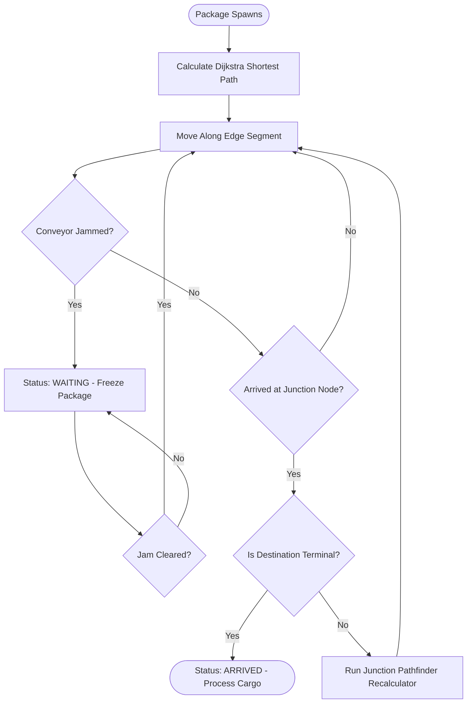

# SortFlow 📦

SortFlow is an interactive, real-time 2D simulation of automated warehouse package sortation. It demonstrates dynamic pathfinding, traffic management, collision avoidance, and real-time path recalculation using **Dijkstra's Algorithm** over a custom web socket connection.

🔗 **Live Demo**: [https://sortflow-demo.vercel.app](https://sortflow-demo.vercel.app)

## Key Features

- **Real-Time 2D Visualizer Canvas**: Custom HTML5 Canvas rendering engine providing smooth, responsive animations for packages and conveyor tracks.
- **Dynamic Dijkstra Pathfinder**: Packages recalculate their optimal paths dynamically at every junction, accounting for active line jams (where conveyor segment weights are updated to $\infty$).
- **Interactive Control Center**:
  - Click on any conveyor segment to toggle a **Jam** (visualized in flashing red).
  - Select custom entry gates and destination docks to preview paths before spawning.
  - Choose standard, express, or fragile payload packages.
  - Adjust simulation speed dynamically.
- **Real-Time LED Simulation Ledger**: Live terminal-style logging of system events (spawns, reroutes, jams, arrivals).
- **Zustand State Management**: High-performance, lightweight React state management.
- **Node/Express & Socket.io Backend**: Seamless real-time state synchronization between the client and simulation loops.

---

## Architecture

SortFlow is built on a real-time event-driven client-server architecture:

```mermaid
graph TD
    subgraph Client (Frontend - React + Vite)
        A[App.tsx Dashboard] --> B[WarehouseCanvas.tsx Renderer]
        A --> C[Zustand Store]
        C -->|State Subscription| A
        C -->|Render Loop Feed| B
        D[Socket.io Client] -->|State Updates & Spawn Events| C
    end
    subgraph Server (Backend - Node + Express)
        E[Socket.io Server] <-->|WS Connection| D
        F[Simulation Loop - Tick Rate] -->|Updates state| G[Simulation State]
        G -->|Emits Frame Updates| E
        H[Dijkstra Router] -->|Calculates Optimal Path| F
        E -->|Toggle Jam / Manual Spawn| F
    end
```

### Monorepo Structure

The project is structured as an NPM monorepo using npm workspaces:

```
├── backend/
│   ├── src/
│   │   ├── server.ts       # Socket.io connection, simulation loop, stats aggregation
│   │   ├── graph.ts        # Graph layout & adjacencies for warehouse nodes & edges
│   │   ├── router.ts       # Dijkstra's shortest path algorithm implementation
│   │   ├── mockData.ts     # Initial node layout and coordinates
│   │   └── types.ts        # Common interfaces
│   └── tsconfig.json
├── frontend/
│   ├── src/
│   │   ├── App.tsx         # Dashboard layout, statistics panels, event logs
│   │   ├── WarehouseCanvas.tsx # Canvas rendering, mouse hovers, track drawing
│   │   ├── store.ts        # Zustand client state & socket listeners
│   │   ├── socket.ts       # Client Socket.io instantiation
│   │   ├── index.css       # Tailwind CSS v4 styling & typography
│   │   └── utils/
│   │       └── dijkstraTracer.ts # Step-by-step pathfinder explainer logger
│   ├── index.html
│   ├── vite.config.ts
│   └── tsconfig.json
├── package.json            # Monorepo workspaces definition and scripts
└── package-lock.json
```

---

## Technical Details

### Pathfinder Logic
The core routing leverages **Dijkstra's Algorithm**. When a conveyor segment's jam status is toggled, its weight is effectively set to `Infinity`. 
1. The backend triggers a reroute command for all affected packages.
2. If a package is already traversing a segment (progress > 0), it is locked onto the segment and will pause at its current position until the jam is cleared.
3. If the package is at a junction node (progress = 0), the pathfinder immediately calculates the next shortest path to its original destination node.

### Package Lifecycle Flow

The flowchart below shows the dynamic state machine of a package as it traverses the warehouse conveyors:



---

## Setup & Running Locally

### Prerequisites
- [Node.js](https://nodejs.org/) (v18+)
- [NPM](https://www.npmjs.com/)

### Installation
From the root directory, install all workspace dependencies:
```bash
npm run install:all
```

### Running the Application
To run both the backend server and frontend development server concurrently:
```bash
npm run dev
```

- **Frontend**: [http://localhost:3000](http://localhost:3000)
- **Backend**: [http://localhost:3001](http://localhost:3001)

### Building for Production
To compile and build both workspaces:
```bash
npm run build
```
